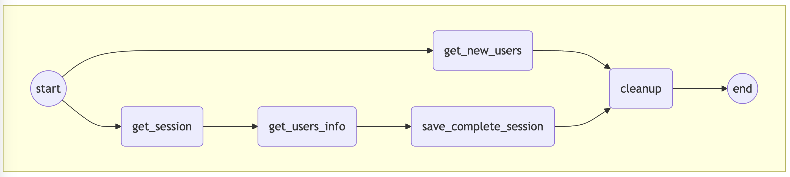
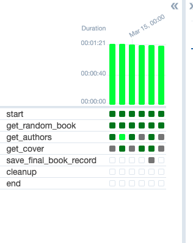

# Airflow 101 - User Sessions Data Pipeline

This project is a Data Engineering pipeline that orchestrates the extraction, transformation, and loading (ETL) of user session data using Apache Airflow. The pipeline is designed to run on a daily schedule, fetching new user and session data, processing it, and storing the aggregated results in an AWS S3 bucket.

## Project Architecture

The workflow is managed by Apache Airflow through a Directed Acyclic Graph (DAG) consisting of several PythonOperator tasks.

### DAG Tasks Workflow:
1. **get_new_users**: Fetches information of new users per date.
2. **get_new_sessions**: Fetches information of new sessions per date.
3. **get_users_info**: Retrieves detailed information for the users fetched.
4. **save_sessions_info**: Combines and saves the complete sessions information.
5. **clean_temp_files**: Cleans up temporary files generated during the pipeline execution.
6. **end**: A dummy operator marking the successful completion of the DAG.

## Technology Stack

- **Orchestration**: Apache Airflow
- **Language**: Python 3
- **Cloud Storage**: AWS S3 (via Boto3)
- **External Services**: REST APIs (simulated via `requests` module)

## Repository Structure

- `src/user_sessions.py`: The main Airflow DAG script containing the ETL logic and task definitions.
- `scripts/restart_airflow.sh`: A shell script to restart the Airflow webserver and scheduler instances.
- `images/`: Contains diagrams and screenshots of the Airflow UI, showing DAG runs, failed tasks, and retries.

## Setup Instructions

1. **Prerequisites**: Ensure you have Docker, Python, and Apache Airflow set up. You will also need valid AWS credentials configured locally to access S3.
2. **Deploy DAG**: Copy `src/user_sessions.py` to your Airflow `dags/` folder.
3. **Set AWS Bucket**: Modify the `RAW_DATA_BUCKET` variable in the `user_sessions.py` script to match your target S3 bucket name.
4. **Start Airflow**: Use the provided `scripts/restart_airflow.sh` (or standard airflow commands) to start the webserver and scheduler.
5. **Run the DAG**: Go to the Airflow UI, unpause the DAG (`user_sessions_dag`), and trigger a manual run.

## Screenshots

- **DAG Graph View**:  
  
- **Successful Run**:  
  
